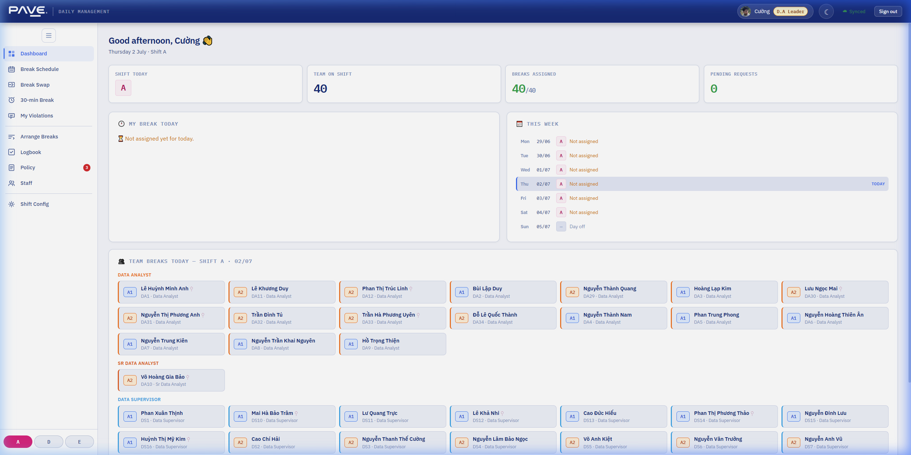
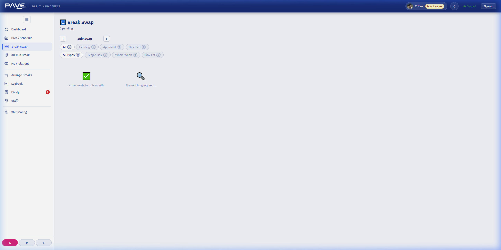
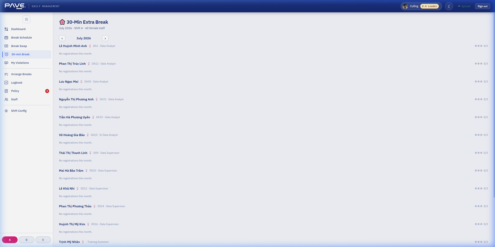

# HƯỚNG DẪN SỬ DỤNG ỨNG DỤNG (DÀNH CHO DS VÀ DA CÁC BỘ PHẬN)

Tài liệu này hướng dẫn cách sử dụng ứng dụng quản lý giờ nghỉ giải lao dành cho tất cả nhân sự thuộc bộ phận **Data Analyst (DA)**, **Sr Data Analyst (Sr DA)**, **Data Supervisor (DS)** và **Sr Data Supervisor (Sr DS)**.

---

## 1. Hướng Dẫn Đăng Nhập

Để đăng nhập vào ứng dụng, vui lòng làm theo các bước sau:

1. Truy cập vào đường dẫn của ứng dụng trên trình duyệt.
2. Tại trang đăng nhập, nhấp vào nút **Sign in with Google** (hoặc **Đăng nhập bằng Google**).
3. Sử dụng email công ty có đuôi `@discoveryloft.com` để đăng nhập (ví dụ: `uyen.tran@discoveryloft.com`).
4. Hệ thống sẽ tự động xác thực và đưa bạn đến trang Dashboard cá nhân.

> [!IMPORTANT]
> Vui lòng **không sử dụng** ô nhập Tên đăng nhập/Mật khẩu thủ công. Luôn sử dụng tùy chọn **Đăng nhập bằng Google** để truy cập ứng dụng nhanh chóng và an toàn nhất.

---

## 2. Các Tính Năng Chính Của Nhân Viên (DA & DS)

### A. Trang Tổng Quan (Dashboard)
Ngay sau khi đăng nhập, bạn sẽ thấy trang Tổng quan hiển thị các thông tin quan trọng nhất trong ngày:

1. **My Break Today (Giờ nghỉ giải lao của tôi hôm nay)**:
   - Hiển thị Slot nghỉ cụ thể được gán cho bạn trong ngày hôm nay (Slot 1 hoặc Slot 2) cùng khung giờ nghỉ tương ứng.
2. **This Week (Lịch tuần này)**:
   - Bảng hiển thị thông tin ca trực và giờ nghỉ giải lao được gán cho bạn từ Thứ Hai đến Chủ Nhật trong tuần hiện tại.

### B. Đổi Giờ Nghỉ Giải Lao (Break Swap)
Nếu bạn có nhu cầu đổi giờ nghỉ giải lao với một đồng nghiệp khác trong cùng ca trực:

1. Chuyển sang mục **Break Swap** trong menu điều hướng.
2. Nhấp vào nút **Tạo yêu cầu đổi giờ nghỉ** (Create Request).
3. Điền thông tin:
   - Chọn ngày muốn đổi.
   - Chọn đồng nghiệp cùng ca mà bạn muốn đổi giờ nghỉ cùng.
4. **Phê duyệt yêu cầu từ đồng nghiệp**:
   - Nếu có đồng nghiệp khác gửi yêu cầu đổi giờ nghỉ cho bạn, bạn có thể bấm **Accept (Đồng ý)** hoặc **Reject (Từ chối)**.

### C. Đăng Ký Nghỉ Thêm 30 Phút (30-min Break / Extbreak)
Tính năng này áp dụng riêng cho nhân sự Nữ (Female staff) theo chế độ đãi ngộ của công ty:

1. Vào mục **30-min Break** trong menu.
2. Bạn có thể gửi yêu cầu xin nghỉ thêm 30 phút trong ca làm việc hôm nay (Tối đa 3 lần/tháng).
3. Xem hạn mức đã sử dụng và lịch sử các ngày đã nghỉ thêm trong tháng hiện tại.
