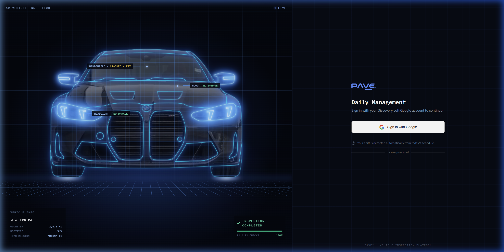
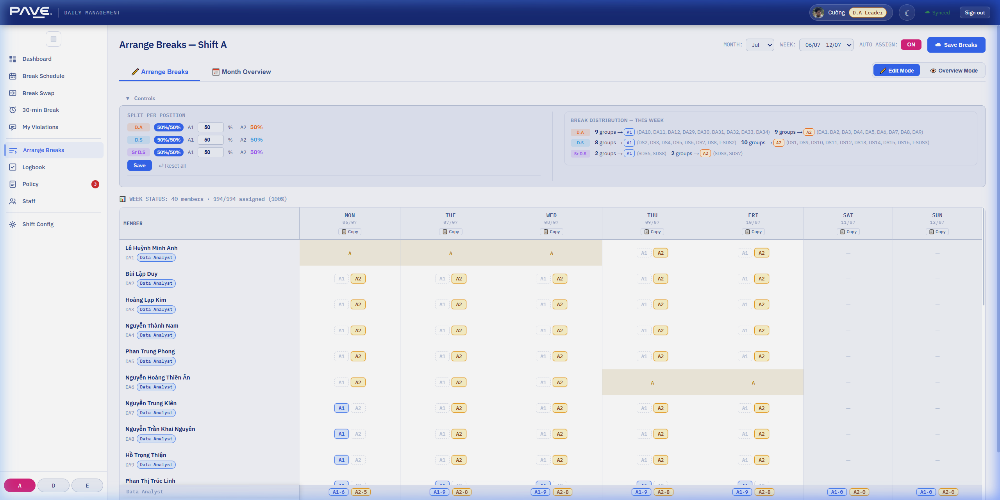
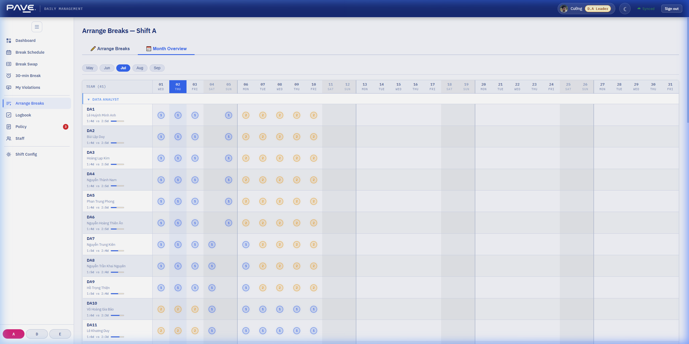
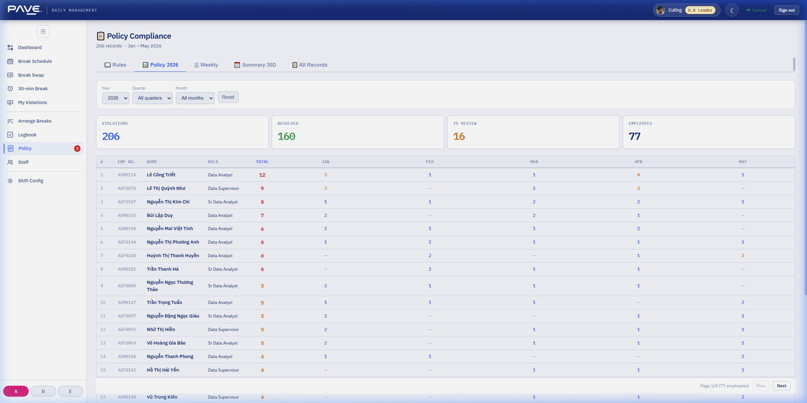

# HƯỚNG DẪN SỬ DỤNG ỨNG DỤNG (DÀNH CHO LEAD / SUB / TRAINING)

Tài liệu này hướng dẫn cách sử dụng ứng dụng quản lý giờ nghỉ giải lao dành cho các cấp quản lý và điều hành bao gồm: **Data Analyst Leader (Lead)**, **Data Analyst Supervisor (Sub)**, **Training Manager / Assistant (Ban Đào tạo)** và **Admin**.

---

## 1. Hướng Dẫn Đăng Nhập

Để truy cập vào hệ thống, vui lòng thực hiện các bước sau:

1. Truy cập vào địa chỉ ứng dụng.
2. Tại màn hình đăng nhập, nhấp vào nút **Sign in with Google** (hoặc **Đăng nhập bằng Google**).
3. Chọn hoặc đăng nhập bằng tài khoản Google công ty có đuôi email là `@discoveryloft.com` (ví dụ: `cuong.pham@discoveryloft.com`).
4. Sau khi xác thực thành công, hệ thống sẽ tự động chuyển hướng bạn đến giao diện làm việc chính tương ứng với quyền hạn của bạn.

> [!IMPORTANT]
> Không sử dụng ô nhập tên đăng nhập và mật khẩu thủ công. Luôn sử dụng hình thức **Đăng nhập bằng Google** bằng email công ty để đảm bảo tính bảo mật và đồng bộ hóa tài khoản.

---

## 2. Tính Năng Dành Cho Lead và Sub (Quản Lý Ca/Nhóm)

Các tài khoản thuộc vai trò **Data Analyst Leader** và **Data Analyst Supervisor** có toàn quyền quản lý và phân bổ lịch nghỉ giải lao cho nhân viên.

### A. Sắp Xếp Giờ Nghỉ (Arrange Breaks)
Đây là khu vực chính để thiết lập giờ nghỉ cho nhân viên trong ca làm việc (Shift A, D, E).

1. **Chọn Ca và Thời Gian**:
   - Sử dụng thanh bộ lọc ở góc trên bên phải để chọn **Ca làm việc (Shift)**, **Tháng (Month)** và **Tuần (Week)** cần sắp xếp.
2. **Gán Giờ Nghỉ Thủ Công**:
   - Trên bảng danh sách nhân viên, nhấp vào ô tương ứng với ngày làm việc của nhân viên để chọn gán **Slot 1**, **Slot 2** hoặc **Không gán/Bỏ gán (—)**.
3. **Gán Giờ Nghỉ Tự Động (Auto Assign)**:
   - Bật tính năng **Auto Assign** (ON) ở phía trên để hệ thống tự động tính toán và phân bổ đều giờ nghỉ cho các nhân sự trong nhóm dựa trên thuật toán cân bằng.
4. **Sao Chép Lịch Nghỉ (Copy Day)**:
   - Nhấp vào nút **Copy** ở đầu cột ngày làm việc để sao chép toàn bộ lịch nghỉ giải lao đã xếp của ngày đó sang các ngày khác trong tuần nhằm tiết kiệm thời gian.
5. **Tổng Quan Tháng (Month Overview)**:
   - Chuyển sang tab **Month Overview** để xem bảng theo dõi lịch nghỉ giải lao của tất cả các ngày trong tháng dưới dạng biểu đồ lưới.

   - Giúp kiểm tra trực quan sự cân bằng số ngày trực Slot 1 và Slot 2 của từng nhân viên theo từng cấp bậc (Data Analyst, Data Supervisor, Sr Data Supervisor).
6. **Lưu Lịch Nghỉ Lên Cloud**:
   - Sau khi hoàn tất sắp xếp, bấm nút **Save Breaks (Lưu lịch nghỉ)** ở góc trên để đẩy dữ liệu lên hệ thống đám mây, giúp nhân viên có thể xem lịch trực tiếp trên Dashboard của họ.

---

## 3. Tính Năng Dành Cho Ban Đào Tạo (Training Manager / Assistant)

Ban Đào tạo tập trung vào việc giám sát và xử lý các vấn đề tuân thủ nội quy của nhân viên.

### A. Kiểm Soát Tuân Thủ Chính Sách (Policy Compliance & Feedback)
- **Tra cứu vi phạm**: Xem danh sách các trường hợp vi phạm chính sách giờ giấc làm việc hoặc nghỉ giải lao (đi muộn, về sớm, nghỉ sai giờ được gán).
- **Phản hồi và Xử lý**: 
  - Xem giải trình/phản hồi từ nhân viên gửi lên.
  - Phê duyệt hoặc từ chối giải trình vi phạm.
  - Bấm nút **✓ Mark Resolved (Đánh dấu đã xử lý)** hoặc hủy bỏ biên bản khiếu nại khi đã thống nhất hướng giải quyết.

